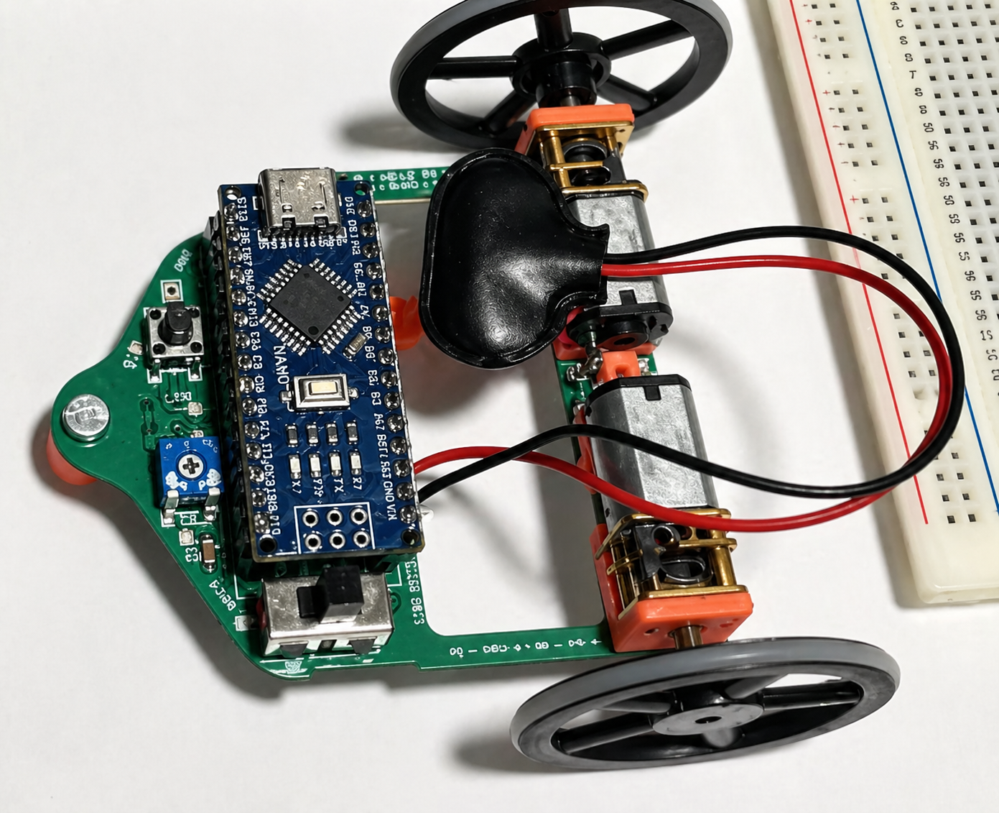

# Line Following Robot using Arduino

## Project Overview



---

## Description
This project is a two-wheeled line-following robot built using an Arduino Nano. The robot is designed to follow a predefined black path on a white surface using an infrared (IR) sensor.

The sensor is positioned very close to the ground (approximately 0.5 cm below the front roller) to ensure accurate detection. The robot continuously adjusts its direction using differential motor control.

---

## Features
- Line detection using IR sensor
- Differential motor control (left/right correction)
- Real-time path tracking
- Adjustable motor speed
- Continuous navigation on curved paths

---

## Hardware & Tools
- Microcontroller: Arduino Nano
- Sensor: IR line detection sensor
- Motors: DC motors (2-wheel drive)
- Chassis: Two-wheel base with front support roller
- Programming Language: Arduino (C/C++)
- Power Supply: Battery

---

## Working Principle
- The IR sensor detects whether the surface is black or white
- If black is detected → one motor is activated
- If white is detected → the other motor is activated
- This creates continuous left-right correction
- The robot follows the path through rapid directional adjustments

---

## Design Insights
- Sensor placement close to the ground improves detection accuracy
- A front roller stabilizes movement while maintaining sensor alignment
- Speed must be limited due to sensor response time
- High speed can cause overshooting of the line
- System performance depends on balancing speed and accuracy

---

## Results
The robot successfully follows a curved (snake-like) path with stable tracking.  
Minor oscillations are visible due to continuous correction, but overall movement remains accurate.

---

## Learning Outcomes
- Understanding of line-following logic
- Practical use of IR sensors
- Differential motor control
- Embedded system design using Arduino
- Real-world limitations (sensor vs speed trade-off)

---

## Author
Kulsang Thupten Sherpa  
Electrical Engineering Student (RWU, Germany)

## Arduino Code

```cpp
#define IR_SENSOR 2

#define LEFT_MOTOR_PIN 5
#define RIGHT_MOTOR_PIN 6

#define MOTOR_SPEED 120

void setup() {
  pinMode(IR_SENSOR, INPUT);
  pinMode(LEFT_MOTOR_PIN, OUTPUT);
  pinMode(RIGHT_MOTOR_PIN, OUTPUT);
}

void loop() {
  int sensorValue = digitalRead(IR_SENSOR);

  if (sensorValue == LOW) {
    // Black detected
    analogWrite(LEFT_MOTOR_PIN, MOTOR_SPEED);
    analogWrite(RIGHT_MOTOR_PIN, 0);
  } 
  else {
    // White detected
    analogWrite(LEFT_MOTOR_PIN, 0);
    analogWrite(RIGHT_MOTOR_PIN, MOTOR_SPEED);
  }
}
